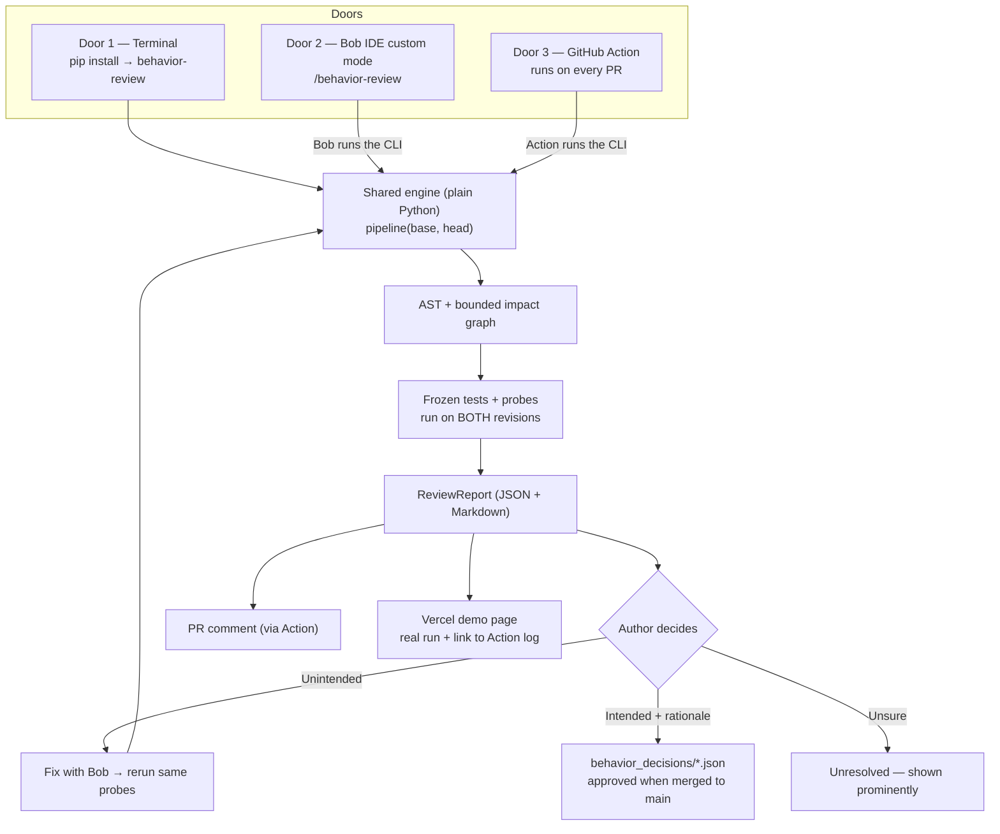
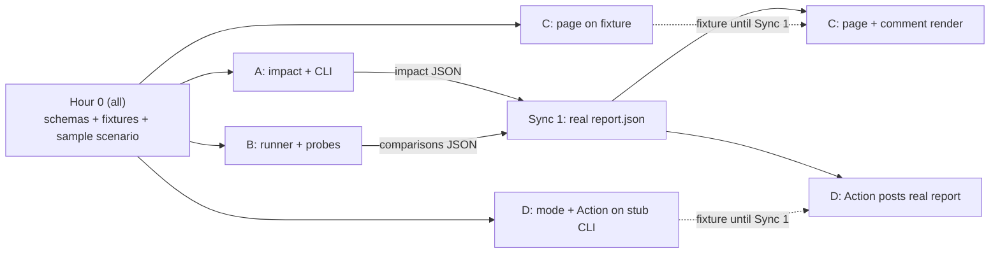

# FINAL PLAN — Behavior Review Before and After a PR

IBM Bob 2.0 Hackathon (lablab.ai) · Updated 26 Sept 2026
Deadline: **27 Sept 2026, 22:00 WIB/Bangkok (15:00 UTC)** · Target upload: **21:00 WIB** · Feature freeze: **14:00 WIB**

This file supersedes HACKATHON_PLAN.md and BOB_BUILD_PLAN.md as the single team plan. Those two files remain useful reference for engineering detail, but where they disagree, this file wins.

> **AI proposes. Algorithms verify. Humans decide.**

---

## 1. The idea in one minute

**Problem.** AI coding assistants make it easy to change code you don't fully understand. A small change to a helper function can silently break a caller in *another file* — one that is not in the diff, and not covered by existing tests. The reviewer sees a clean diff and green tests, and approves.

**What we build.** A tool that, *before* a PR is opened (and again after), answers three questions with **real execution evidence**, not AI opinion:

1. **What else could this change affect?** → an impact graph finds callers outside the diff.
2. **Did behavior actually change?** → the same frozen inputs run on the old and new code; outputs are compared.
3. **Was that change intended?** → the author must mark each difference as *unintended* (fix it), *intended* (write the reason), or *unresolved*. Intended changes are saved as versioned decisions the team can look up later.

**Pitch line:** *"Green tests and a clean diff can still hide a broken caller. We show the author what changed in behavior — with proof — before the reviewer ever sees the PR."*

### Framing: Management of Change (MOC) for code

Borrowed from oil & gas, where no change to a running plant is allowed without a formal MOC process. Our flow maps 1:1:

| MOC in industry | Our product |
|---|---|
| Identify what the change touches | Impact graph (AST, callers outside the diff) |
| Hazard assessment | Behavior diff: same inputs, old vs new outputs |
| Sign-off by responsible person | Author disposition: unintended / intended + rationale / unresolved |
| Update controlled documents | `behavior_decisions/` ledger, approved by merge to `main` |
| Incident investigation uses the records | Later reviews cite approved decisions |

Use this analogy in the video intro and slides — it's memorable and shows domain thinking.

---

## 2. Gap analysis (for the Problem & Solution statement)

| | |
|---|---|
| **Current situation** | Authors ship AI-assisted changes; reviewers read the diff and trust CI. Review is slow and trust is low because the reviewer has to reconstruct the impact themselves. |
| **Desired situation** | The author already knows what their change affects and which behaviors changed, and has fixed or justified each difference before asking for review. |
| **The gap** | Diffs only show changed lines. Tests only check what someone thought to test. AI reviewers give *opinions* that can hallucinate. Nothing ties "this caller behaves differently" to "and the author confirmed it was intended." |
| **Existing solutions** | AI PR reviewers (LLM comments on the diff), test impact analysis (selects tests, doesn't find untested behavior changes), code-graph tools like PRISM (show structure, AI runtime is an external LLM, Bob only used during development). |
| **Our solution** | Deterministic impact graph + paired execution on both revisions + mandatory human intent + versioned decision ledger — and **Bob inside the product loop** to write targeted probes and fix unintended changes. |

---

## 3. Why this can win

| What judges should notice | How we deliver it |
|---|---|
| Bob is a **core component**, not just the tool we coded with | A committed **Bob IDE custom mode** (`/behavior-review`) is part of the product: it runs our CLI, reads the evidence, writes probes for uncovered callers, and helps fix unintended changes. Plus every teammate's real Bob task summaries. |
| A real "wow" moment | Existing tests are **all green**, yet our tool shows a caller in another file now returns a different value for the same input. |
| No hallucination | Every claim in the report comes from AST parsing or real execution. The LLM never decides "bug or not." |
| Honest about limits | Unknown edges are shown as *unknown*, never as *safe*. Setup failures are *inconclusive*, never *bug*. |
| Something judges can open | Public Vercel demo page showing a real run, linked to its public GitHub Actions log. |

Learned from Bob 1.0 winners (Atlas, Pedigree, Sandbox): none built a custom "agent" — the core was ordinary deterministic code, with AI called in a few focused places. Pedigree used a Bob custom mode + MCP. We follow the same pattern.

---

## 4. Architecture: one engine, three doors, one demo page



**Key design rule:** the engine is `pipeline(base_revision, head_revision)` and knows nothing about GitHub, Bob, or the web. Each door just calls it differently.

| Door | Who | When | How it's called |
|---|---|---|---|
| 1. CLI | Developer | Before PR | `behavior-review --base main --head HEAD` in a terminal |
| 2. Bob custom mode | Developer | Before PR (the showcase path) | Type `/behavior-review` in Bob IDE chat; Bob runs the CLI, explains results, writes missing probes, helps fix |
| 3. GitHub Action | Reviewer | After PR opens / new push | Automatic; posts or updates one PR comment |
| Demo page | Judges | Anytime | Opens a Vercel URL, no install, no login |

**No webhook server, no queue, no worker, no database server.** GitHub Actions replaces all of that. (If Vercel becomes a bottleneck later, move to a small always-on Python host — see §11.)

---

## 5. How each step works (and what it can't claim)

| Step | Method | Claims | Never claims |
|---|---|---|---|
| Changed symbols | Python `ast` on both revisions | Which functions/signatures/imports/bodies changed; tags like `signature_changed`, `body_changed` | *Why* it changed |
| Impact graph | Dict/adjacency list; reverse callers up to 2 hops; union of old+new edges | Callers outside the diff, with file:line path, e.g. `price_total → apply_discount` | "No impact" when edges are unresolved — those are listed as **unknown** |
| Existing tests | Freeze the **base** test suite, run the identical suite on both revisions | Pass/fail on each side | That passing = correct |
| Probes | Small deterministic scripts, JSON inputs/outputs, identical bytes on both revisions | "Same input → different output" | Equivalence for all inputs |
| Explanation / probe writing / fix | **Bob** (IDE custom mode) | Proposes probes and fixes, explains results | Any verdict — results only come from execution |
| Decision | Human | Unintended / intended + rationale / unresolved | Bob never picks intent or writes a rationale the author didn't confirm |

### Anti-hallucination rules (non-negotiable)

1. A model's answer is not a test result. Only real process output counts.
2. Unknown edge ≠ no impact. Show it as unknown.
3. Setup/import error, timeout, nondeterminism → **inconclusive**, never "bug".
4. Never edit a probe to make a difference disappear. Fixes rerun the **unchanged** probe.
5. Author intent never overrides failed execution.
6. Every result is labeled: which commit, which probe hash, when it ran.

### Outcomes

| Observation | Label |
|---|---|
| Same outputs, tests pass | `same_on_tested_cases` (not "proven safe") |
| Different value/exception for same input | `delta_observed` → needs a human decision |
| Old test passes on base, fails on new | possible regression **or** intentional contract change → check intent |
| Both revisions fail | pre-existing issue, not blamed on this change |
| Import error / timeout / bad probe | `inconclusive` |

---

## 6. Locked demo scenario (decide in hour 0, don't change after)

A small, original, pure-Python sample package (no DB, network, clock). Example:

```
sample_project/
  pricing/discount.py   # apply_discount()          ← the PR changes this
  pricing/invoice.py    # price_total() calls apply_discount()  ← NOT in the diff
  tests/test_discount.py  # tests apply_discount only — stays GREEN after the change
```

**The PR:** someone (with AI help) "cleans up" `apply_discount` and changes rounding (e.g. round per item instead of on the total).

**What the tool shows:**
1. Diff touches only `discount.py`. **All existing tests pass.**
2. Impact graph: `invoice.price_total` (other file) calls the changed function.
3. Bob writes a probe for `price_total` with a boundary input.
4. Probe runs on both revisions: old `100.00`, new `99.99` → `delta_observed`.
5. Author marks it **unintended** → Bob helps fix → same probe reruns → `same_on_tested_cases`, linked to the original delta.

Required scenarios (each needs real run evidence):

| # | Scenario | Expected |
|---|---|---|
| 1 | Helper change breaks caller outside diff, **existing tests green** | Impact path, delta, unintended, Bob fix, rerun |
| 2 | Intentional policy change (e.g. max discount 50% → 30%) | Delta, required rationale, decision JSON, approved by merge |
| 3 | Behavior-preserving refactor | Structural change, no delta on frozen cases |
| 4 | Broken setup / unresolved import | Inconclusive, never "safe", never "bug" |
| 5 | Later change to the same function | Report cites the approved decision from #2 |

---

## 7. Decision ledger (`behavior_decisions/`)

One JSON per decision: `id`, repo, path/symbol, base/head SHAs, probe hash, before/after behavior, intent, rationale, requirement ref (optional), status, `supersedes`.

**Trust rule (simple):** a decision written in a PR branch is only *proposed*. It becomes **approved when it is merged into `main`** — the normal PR review is the approval. No separate login or reviewer system.

Lookup matches exact repo + path + symbol from approved records on `main`. Stale/renamed/superseded records are shown as such, never guessed. History informs a review; it never auto-approves a new difference.

---

## 8. Scope

| Priority | Feature | Done when |
|---|---|---|
| **P0.1** | Revision pair + schema | CLI takes two local commits, no PR needed, doesn't touch the working tree |
| **P0.2** | AST + bounded impact | Scenario 1 shows the caller outside the diff with file:line path and unknowns listed |
| **P0.3** | Paired execution | Identical tests + probes run on both revisions; real outputs saved |
| **P0.4** | Human decision loop | Every delta gets unintended / intended+rationale / unresolved; fixes rerun |
| **P0.5** | Report | JSON + Markdown: impact path, inputs, old/new outputs, decision, limits |
| **P0.6** | **Bob custom mode** | `/behavior-review` in Bob IDE runs the CLI, explains, proposes a probe, helps fix |
| **P1.1** | GitHub Action | PR → Action runs CLI → one PR comment updated per push; report uploaded as artifact |
| **P1.2** | Ledger + lookup | Scenario 5 cites the decision approved in Scenario 2 |
| **P1.3** | Vercel demo page | Judge opens URL, sees a real run (with Action log link), clicks through impact path and old/new outputs, tries a session-only decision with rationale |
| P2 | Polish | Only after all above work |

**Cut order if time runs out:** visual polish → richer graph coverage → Scenario 5 lookup → demo page interactivity (keep a static page) → nothing else.
**Never cut:** real paired execution, caller-outside-diff, human decision + ledger, Bob custom mode.

**Deferred (say so honestly):** languages other than Python, class-heavy/dynamic code, arbitrary repos, forks, container sandboxing, Jev, Pi, webhook server, IDE extensions, Jenkins, autonomous fix loops.

---

## 9. Repository layout

```
behavior-review/
  pyproject.toml                 # pip install -e .  → `behavior-review` command
  AGENTS.md                      # SHORT: scope, contracts, commands, ownership (no essays)
  app/
    schemas.py                   # A — shared Pydantic models (ReviewReport, ProbeBundle, Decision)
    snapshot.py                  # A — resolve base/head into isolated checkouts (git worktree)
    impact.py                    # A — AST + graph
    cli.py                       # A — pipeline(base, head) + CLI entry
    runner.py                    # B — run frozen tests/probes on both revisions, compare
    decisions.py                 # D — validate/save decisions, lookup approved ones
    report.py                    # C — Markdown (PR comment) + web data from ReviewReport
  probes/                        # B — committed probes (Bob-authored, reused by the Action)
  sample_project/                # B — the demo package, its tests, seeded scenario branches
  behavior_decisions/            # D — ledger
  contracts/                     # ALL in hour 0, then A — fixture JSON per boundary
  .bob/custom_modes.yaml         # D — the /behavior-review mode (verify IDE path in hour 0)
  .github/workflows/behavior-review.yml   # D — the Action
  web/                           # C — Vercel demo page (reads report JSON)
  handoffs/A.md B.md C.md D.md   # each owner, ~1 page
  bob_sessions/                  # everyone's real Bob task summary screenshots
```

Stack: Python, stdlib `ast` + `git` subprocess, pytest, Pydantic. Web page: simplest thing that deploys to Vercel (static HTML/JS reading JSON is fine). No React-heavy frontend, no ORM, no Redis, no graph DB, no vector store.

### Contracts

| Function | Input → Output | Owner |
|---|---|---|
| `snapshot.resolve_pair` | repo, base, head → RevisionPair (paths + SHAs) | A |
| `impact.analyze` | RevisionPair → changed symbols, edges, paths, unknowns | A |
| `runner.compare` | RevisionPair, ProbeBundle → observations, outcomes, errors | B |
| `decisions.validate_and_save` | delta, disposition, rationale → Decision or error | D |
| `decisions.lookup` | approved records, symbols → matches / stale | D |
| `report.render` | ReviewReport → Markdown, web data | C |

A approves any shared schema change and tells affected owners.

### GitHub Action (sketch)

On `pull_request` (opened, synchronize, reopened): checkout with full history → `pip install -e .` → `behavior-review --base origin/${{ github.base_ref }} --head HEAD --format markdown --out report.md --json report.json` → upload `report.json` as artifact → create/update **one** PR comment. Permissions: `contents: read`, `pull-requests: write`. The Action **reuses committed probes**; it never calls Bob. If an impacted caller has no probe, the report says `needs_bob_action` — the author runs `/behavior-review` in Bob IDE to create one.

---

## 10. Team: four parallel lanes

### How we work in parallel without waiting on each other

**Contract first, then fixtures.** In hour 0 the whole team agrees on *what the data looks like* (`app/schemas.py`) and writes one realistic **fixture** per boundary in `contracts/` — e.g. a hand-written `report_scenario1.json` that looks exactly like what the finished engine will output for Scenario 1. A fixture is a clearly labeled fake example: it lets the UI person build the page and the GitHub person build the PR comment **before** the engine exists. At each sync point, fixtures are swapped for real outputs.

Like building a house from one blueprint: the electrician and the plumber work at the same time because they agreed where the pipes and wires go.

### The four lanes

| Lane | Owns (files) | Builds against (until real) | Hands to | Good fit for |
|---|---|---|---|---|
| **A — Analysis logic** | `schemas.py`, `snapshot.py`, `impact.py`, `cli.py`, `pyproject.toml`, `contracts/` | B's `sample_project/` (real from hour 0) | `impact` JSON → C, D; CLI → D | Strongest Python/AST person |
| **B — Execution logic** | `sample_project/`, `runner.py`, `probes/` | Two plain folders (old/new copy) — doesn't need A's snapshot to start | `comparisons` JSON → C; probe format → D | Comfortable with pytest/subprocess |
| **C — Demo UI & story** | `web/`, `report.py`, slides, video, both 500-word statements | `contracts/report_scenario*.json` fixtures | Vercel URL, PR-comment Markdown → D, final video | Strong at presenting/design, lighter coding |
| **D — Bob, GitHub & knowledge** | `.bob/custom_modes.yaml`, `.github/workflows/`, `decisions.py`, `behavior_decisions/` | A stub CLI that prints the fixture report | Working `/behavior-review`, PR comment, ledger lookup | Likes integration/tooling |

Everyone: own Bob sessions + `bob_sessions/` screenshots + own `handoffs/<lane>.md`.

### Dependency map (who waits on whom — and what they use meanwhile)



Nobody is blocked in blocks 1–2: A and B only need the sample project (B makes it in hour 0 with everyone), C and D only need fixtures.

### Swimlane schedule

T0 = the moment the team starts. Clock times are fixed at the end.

| Block | A — Analysis | B — Execution | C — Demo UI & story | D — Bob, GitHub & knowledge |
|---|---|---|---|---|
| **Hour 0 (all together, ~60–90 min)** | Repo + scaffold + `schemas.py` | Write `sample_project/` (discount/invoice/tests) + scenario 1 branch | Deploy "hello" page to Vercel; draft fixture `report_scenario1.json` with A | Dummy custom mode test in Bob IDE (5 min); check all Bobcoin balances |
| **Block 1 (T+1.5 → T+6)** | `snapshot` (git worktree) → AST changed symbols → graph finds `price_total` outside diff | Probe format + runner: run one probe on old/new folders, capture outputs, classify outcome | Page on fixture: impact path, old vs new table, decision form (session only); `report.render` → Markdown | `/behavior-review` mode calling a **stub CLI**; Action that installs repo + posts stub Markdown as PR comment |
| **Sync 1 (T+6, 30 min, all)** | CLI calls B's runner → **first real `report.json`** for Scenario 1 | Plug runner into A's `RevisionPair` | Page reads the real JSON | Action runs the real CLI on a real PR |
| **Block 2 (T+6.5 → T+10)** | Unknown edges, 2-hop paths, `pip install` in a clean env | Scenarios 3 & 4 (refactor, broken setup), probe hashes, rerun linking | Link each run to its Actions log; slide outline + MOC story | `decisions.py` + ledger; Scenario 2 (intended + rationale); Bob mode writes a probe in B's format |
| **Sync 2 (T+10, 20 min, all)** | Merge; tag a demo-ready commit | Verify all probe results are real, not fixture | Page switched fully off fixtures | Scenario 5 lookup plan |
| **Night** | Everyone sleeps at least 4–5 hours. Shifts are fine, but nobody merges to `main` alone at 3 a.m. | | | |
| **Morning → 14:00** | Bug fixes, README install/run section | Rerun all 5 scenarios for real; save evidence | Final page, cover image, video script locked | Scenario 5 lookup; **record Bob fix footage** (Scenario 1) |
| **14:00 freeze → 21:00** | Verify every technical claim in video/statements | Evidence index (which run proves which claim) | **Lead:** video edit, slides, Problem & Solution statement | Bob Usage statement, collect everyone's `bob_sessions/`, submission form |

### Rules that keep lanes parallel

1. **Only edit your own files.** Need a change elsewhere? Ask that lane owner.
2. **Schema changes go through A** and are announced in the group immediately; A updates the fixtures in the same commit.
3. **Small merges to `main`, often** (at least every 2–3 hours). Each lane works on its own branch and opens a PR — once D's Action works, **our own PRs get reviewed by our own tool** (free dogfooding footage).
4. **Fixtures are always labeled** (`"fixture": true`) and must be gone from anything shown in the final demo.
5. Stuck > 45 minutes? Post in the group; another lane may unblock you in 5.

### Bobcoins

4 participants × 40 Bobcoins = 160 (check real balances in hour 0; credits are per account and not transferable).

| Lane | Setup / module / integration / reserve |
|---|---|
| A | 4 / 20 / 8 / 8 |
| B | 4 / 24 / 4 / 8 |
| C | 4 / 16 / 8 / 12 (lighter coding; reserve for page fixes) |
| D | 4 / 20 / 8 / 8 (the recorded Bob fix comes from D's reserve) |

Checkpoints per person: ~4 coins → working first result, check balance; ~20 → callable module delivered; 32 → stop features, keep the reserve for integration/fixes/demo.

**Handoff file** (`handoffs/<owner>.md`, ~1 page): branch + commit SHA, what works, contracts/fixtures, commands run + real results, blockers, next task, coins spent/remaining + time, screenshot paths.

**Starter prompt for each Bob session:**
> Read AGENTS.md, contracts/, and handoffs/<me>.md. My scope is <module>. Implement the next acceptance criterion from FINAL_PLAN.md §8 in my own files only. Don't change shared schemas or other owners' files. Run the relevant checks, report real results, and update my handoff.

Rules: one bounded task per Bob session; no full-repo re-scans; integrate a thin slice early (revision pair → impact → one real comparison → report) and everyone builds on that commit.

---

## 11. Deployment

- **Now:** Vercel hosts the demo page only. It reads report JSON produced by **real** CLI/Action runs and links to the public Actions log for each run. Label clearly: *"Probe authored with Bob · executed in GitHub Actions run #N."*
- **Visitor decisions** on the page are session-only (not saved, can't approve anything).
- **Upgrade path (only if time allows or Vercel limits bite):** add a small always-on Python host (e.g. Render/Railway/Fly — check current pricing) with a "Run live" button that executes the fixed sample via subprocess + timeout. Never run arbitrary visitor code.
- Test from a fresh browser outside the team's machines: no login wall, HTTPS works, links work. Keep it up through judging.

---

## 12. Fixed deadlines (WIB)

The per-lane schedule is in §10. These times do not move:

| When | What |
|---|---|
| **Sync 1** | First real `report.json` for Scenario 1 — if this slips past ~T+8, cut P1 extras immediately (§8 cut order) |
| **27 Sept, 14:00** | **Feature freeze** — only bug fixes after this |
| 14:00–20:00 | Video, slides, statements, bob_sessions screenshots, README, fresh-browser test |
| **21:00** | **Upload** (hard deadline 22:00) |

---

## 13. Three-minute video (4 moments)

| Time | Moment |
|---|---|
| 0:00–0:20 | **Problem + MOC hook.** "In oil & gas, you can't change a plant without Management of Change. In code, an AI can change a helper and nobody checks who else depends on it." |
| 0:20–1:20 | **The catch.** Diff = 1 file, all tests green. `/behavior-review` in Bob IDE → graph finds `invoice.price_total` in another file → Bob writes a probe → same input, old 100.00 vs new 99.99. |
| 1:20–2:10 | **The fix + the decision.** Author: unintended → Bob fixes → same probe reruns clean. Second change: intended → rationale → decision JSON → merged = approved. |
| 2:10–2:45 | **After the PR.** GitHub Action posts the same evidence on the PR; later change cites the approved decision. Show the Vercel page. |
| 2:45–3:00 | **Close.** "AI proposes, algorithms verify, humans decide." Honest limits + what Bob did. |

≥ 90 s of the solution running (we have ~2:25). Record real runs at normal speed; cut only idle waits and disclose cuts.

---

## 14. Submission checklist

- [ ] Public repo, MIT license, original code, synthetic sample only, dependency licenses listed
- [ ] `bob_sessions/` — real task summary screenshots from **every** participant (Bob IDE → Tasks → task header)
- [ ] Problem & Solution statement ≤ 500 words (use §1–2)
- [ ] Bob Usage statement ≤ 500 words — what Bob actually built, the custom mode, probes it wrote, the fix; say honestly what was manual
- [ ] MP4 ≤ 3 min, ≥ 90 s solution
- [ ] Slides, cover image, tags, description, Vercel URL
- [ ] README: install (`pip install -e .`), run CLI, use `/behavior-review`, how the Action works, limits
- [ ] No secrets, no local paths (e.g. `C:/Users/...`) in published files
- [ ] Fresh-browser check of every link before 21:00

---

## 15. Confirm in hour 0

1. **Who takes which lane (A / B / C / D)?** C also leads the video and pitch.
2. **Bob IDE custom mode:** does `.bob/custom_modes.yaml` (or the IDE's equivalent) register `/behavior-review` in Bob IDE, not only Bob Shell? D tests with a 5-minute dummy mode. Fallback: a committed prompt file the developer pastes into Bob, disclosed as manual.
3. **Real Bobcoin balances** of all four accounts.
4. **Product name** (shown in video/slides/repo). Candidates: *BlastRadius*, *ChangeGuard*, *BehaviorLock*, *MOC for Code*.
5. **Sample scenario details** (§6) — exact functions and the rounding change, so B and D build the same thing.
